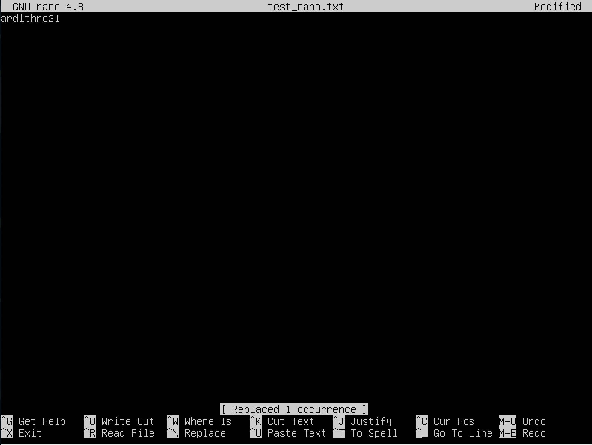

## Part 1. Установка ОС

>Установленная версия Ubuntu 20.04 Server LTS без графического интерфейса.

## Part 2. Создание пользователя

> Вызов команды для создания пользователя.

>Вывод команды "cat /etc/passwd".

## Part 3. Настройка сети ОС
1. Задаем название машины и сохраняем изменения.

>Задали название машины.

>Сохраненные изменения.

2. Установить временную зону, соответствующую вашему местоположению.

>Установка нужной временной зоны".

3. Вывести названия сетевых интерфейсов с помощью консольной команды. 
4. Определить и вывести на экран внешний ip-адрес шлюза (ip) и внутренний IP-адрес шлюза, он же ip-адрес по умолчанию (gw).  

>Вывод сетевых интерфейсов и ip адресов с помощью ifconfig.

Loopback Interface - на Unix-like системах lo или lo0 - виртуальный интерфейс, присутствующий по умолчанию в любом Linux. Он используется для отладки сетевых программ и запуска серверных приложений на локальной машине.  

5. Используя консольную команду, получить ip адрес устройства, на котором вы работаете, от DHCP сервера.  

>Получение ip адреса от DHCP сервера.

DHCP (англ. Dynamic Host Configuration Protocol — протокол динамической настройки узла) — прикладной протокол, позволяющий сетевым устройствам автоматически получать IP-адрес и другие параметры, необходимые для работы в сети TCP/IP.  

6. Задаем статичные настройки ip, gw, dns.

>Задаем статичные настройки ip, gw, dns.

- После редактирования настроек, применяем их с помощью команды "netplan try"/"netplan apply". Если ошибок нет, будет выведено предложение применить новые настройки.

7. Пингуем удаленные хосты.

>Пингуем 1.1.1.1.

>Пингуем ya.ru.

## Part 4. Обновление ОС

>Проверка наличия обновлений с помощью команды "sudo apt upgrade".

## Part 5. Использование команды sudo

 1. Объяснение назначения команды "sudo".
  - Команда sudo (substitute user and do, подменить пользователя и выполнить) позволяет строго определенным пользователям выполнять указанные программы с административными привилегиями без ввода пароля суперпользователя root. 
2. Разрешаем пользователю выполнять команду sudo
3. Изменением hostname от имени new_user

>Вызов и вывод команды hostname.

## Part 6. Установка и настройка службы времени

>Вывод времени с помощью команды "date".

>Вывод времени с помощью команды "timedatectl".

>Настройка службы автоматической синхронизации времени NTP.

## Part 7. Установка и использование текстовых редакторов

 1. Выход и сохранение:
 - Выход из vim и сохранение: ":wq".
 - Выход из nano и сохранение: "ctrl+X", "Save modified buffer? Y".
 - Сохранение и выход из mcedit: esc - yes.

>Vim, имя".

>Nano, имя".

>Mcedit, имя".

12. выход без сохранения изменений:
- vim: ":q!"
- выход без сохранения изменений nano: "ctrl+X", "Save modified buffer? N".
- выход без сохранения изменений mcedit: esc - no.

>Vim, изменение содержимого файла".

>Nano, изменение содержимого файла".

>Mcedit, изменение содержимого файла".

3. Поиск по содержимому файла (слово) и замены слова на любое другое.
- vim: поиск: "/*слово*", поиск с заменой: ":s/*слово*/*замена*/g"
- nano: поиск: "ctrl + W", поиск с заменой: "ctrl + |".
- mcedit: поиск F7, замена F4.

>Vim, замена слова".

>Nano, замена слова".

>Mcedit, замена слова".

## Part 8. Установка и базовая настройка сервиса SSHD
1. Установить службу SSHd.
- Для установки необходимо установить SSH или Secure Shell - это протокол безопасного доступа из одного компьютера к другому по сети. Выполняется с помощью команды "sudo apt install openssh-server".
2. Добавить автостарт при загрузке системы.
- Для того, чтобы служба запускалась автоматически, нужно добавить его в автозагрузку. Для этого необходимо выполнить команду:"sudo systemctl enable ssh.service".
3. Перенастроить службу SSHd на порт 2022.

>Редактирование "sshd_config" для замены порта.

4. Использование команды "ps" для демонстрации наличия sshd.

>Выполнение команды "ps".

Значение ps - отображение текущих процессов на экране пользователя.  
ax - показать все процессы.  
-f - полноформатный вывод (отвечает за форматирование).   
-v - показывает формат виртуальной памяти.  
grep sshd - находит на вводе строки регулярное выражение sshd и выводит их.

5. Перезагрузка системы.

>Выполнение команды "netstat-tan".

- Команда netstat, входящая в стандартный набор сетевых инструментов UNIX, отображает различную network–related информацию, такую как сетевые подключения, статистику интерфейсов, таблицы маршрутизации, masquerade, multicast, и т.п.

-n - Отображение адресов и номеров портов в числовом формате.  
-a - Отображение всех подключений и ожидающих портов.  
-t - Отображение текущего подключения в состоянии переноса нагрузки с процессора на сетевой адаптер при передаче данных.

**Proto:** Протокол (tcp, udp, raw), используемый сокетом.  
**Recv-Q:** Счётчик байтов, не скопированных программой пользователя из этого сокета.  
**Send-Q:** Счётчик байтов, не подтверждённых удалённым узлом.  
**Local Address:** Адрес и номер порта локального конца сокета.  
**Foreign Address:** Адрес и номер порта удалённого конца сокета.  
**State:** Состояние сокета.  

**IP-адрес 0.0.0.0** — это немаршрутизируемый адрес IPv4, который можно использовать в разных целях, в основном, в качестве адреса по умолчанию или адреса-заполнителя. Он не является адресом какого-либо устройства.

## Part 9. Установка и использование утилит top, htop
 1. Команда "top".
 
 
>Вывод команды "top".

- uptime: 3 мин.
- количество авторизованных пользователей: 1 user
- общая загрузка системы: Load average 0.05 0.09 0.04
- общее количество процессов: 99 total, 1 running, 98 sleeping, 0 stopped, 0 zombie

- загрузка cpu: 
   - us — пользовательские процессы (высокое значение данного показателя может указывать, в том числе, на проблемы в коде сайта, необходимость его оптимизации): 0.0.
   - sy — процессы ядра: 0.3.
   - id — неиспользуемые ресурсы: 99.7.
   - wa — операции ввода/вывода, т.е. дисковые операции: 0.0.

- загрузка памяти:
    - Mem: 1983.4 total 1619.9 free, 139.7 used, 223.8 buff/cache
	- Swap: 1738 total, 1738.0 free, 0.0 used, 1696.3 avail Mem
- pid процесса занимающего больше всего памяти: 1288
- pid процесса, занимающего больше всего процессорного времени: 1288

2. Команда "htop".

 
>Процессы, отсортированные по PID.

 
>Процессы, отсортированные по PERCENT_CPU.

 
>Процессы, отсортированные по PERCENT_MEM.

 
>Процессы, отсортированные по TIME.

 
>Htop для процесса sshd.

 
>Htop с процессом syslog, найденным, используя поиск.

 
>Htop с добавленным выводом.

## Part 10. Использование утилиты fdisk

 
>Вывод fdisk.

- Название диска: /dev/sda
- Модель диска: VBOX HARDDISK
- Размер и количество сeкторов: 10 Gb, 20971520 sectors
- Размер SWAP: 10737418240

## Part 11. Использование утилиты df
 
 
>Вывод df и df -Th.

1. df Для корневого раздела:
- Размер раздела: 9299276
- Размер занятого пространства:4129216
- Размер свободного пространства: 4676084
- Процент использования: 47%
- Единица измерения в выводе: Килобайт

2. df -Th для корневого раздела:
- Размер раздела: 8.9G
- Размер занятого пространства: 4.0G
- Размер свободного пространства: 4.5G
- Процент использования: 47%
- Тип файловой системы для раздела:ext4

## Part 12. Использование утилиты du
- Опция "h", --human-readable - выводить размер в единицах измерения удобных для человека;
- Опция "a", --all - выводить размер для всех файлов, а не только для директорий, по умолчанию размер выводится только для папок;
 
 
>du для папки /home.

 
>du для папки /var.

 
>du для папки /var/log.

 
>du -ha для папки /var/log/*.

## Part 13. Установка и использование утилиты ncdu

 
>ncdu для папки /home.

 
>ncdu для папки /var.

 
>ncdu для папки /var/log.

## Part 14. Работа с системными журналами

 
>Время последнего успешного входа в систему, имя пользователя и способ входа в систему.

- Время последней успешной авторизации: Aug 17 10.58.45
- Имя пользователя: ardithno
- Метод входа в систему: by LOGIN

 
>Информация из файла /var/log/syslog, показывающий сообщение о перезапуске службы SSHd.

## Part 15. Использование планировщика заданий CRON 

1. Cписок текущих заданий для CRON.

 
>CRON список задач.

2.  Cтрочки о выполнении и список текущих задач в /var/log/syslog.

 
>Системный журнал, выполнение "uptime".

3. Удаление заданий из планировщика заданий.

 
>Рисунок №56. Просмотр журнала после удаления.